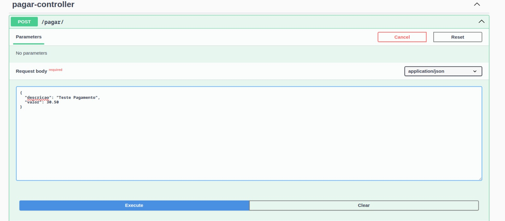
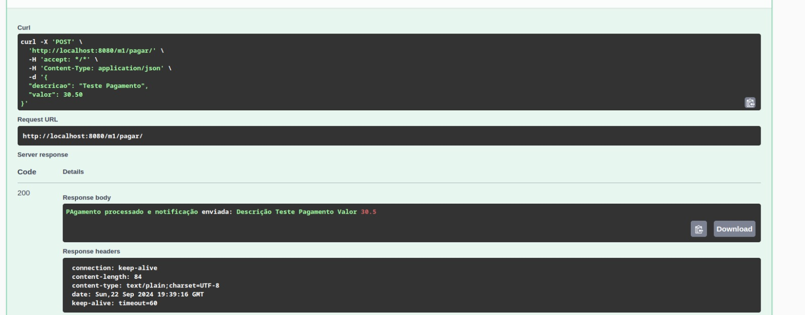
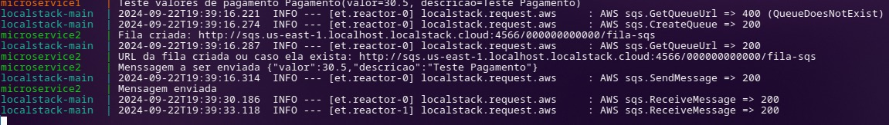

# Sistema de Microserviços

Esse trabalho em tres serviçoes que se comunicam entre si, seguindo os requisitos da descrição do trabalho:

Requisitos
1) Deverá ser desenvolvido um microserviço ("Microserviço 1") como cliente em que receberá requisições HTTP em um endpoint chamado "POST /pagar"

2) Deverá ser desenvolvido um microserviço ("Microserviço 2") como servidor em que receberá requisições HTTP do microserviço 1 no endpoint "POST /notificar" 

3) Este microserviço 2 deverá postar uma mensagem em um tópico de mensageria (Ex. AWS SQS ou Rabbit MQ) 

4) Ambos os serviços deverão ter um Dockerfile ou docker-compose e um arquivo README explicando como subir os serviços 

Esse projeto utilizei a fila de mensagem AmazoSQS, utilizei o SqsClient do AWS SDK com Java e spring para cria um serviço de envio de mensagem para a fila, e para simular a fila utilizei o LocalStack onde é executado um container onde podemos simular outros serviços este ambiente oferece a mesma funcionalidade e APIs do ambiente cloud da AWS.
Cada serviço utiliza o swager para documentar os serviçoes voce pose acessar eles localmente atravess dessa url's: 

```
    http://localhost:8080/m1/swagger-ui.html/ <- Serviço do microserviço 1
    http://localhost:8081/m2/swagger-ui.html/ <- Serviço do microserviço 2 

```

## Pré-requisitos
- Amazon CLI
- Docker
- Docker Compose
- Spring-boot
- Spring Cloud

## Como rodar

1. Executar esse comando ``` sudo docker-compose up --build ``` (Assim voce pode ver a execução dos tres serviçoes)
2. Acesse a rota do M1 e execute o POST /pagar/ 
    Dessa forma: 
    

    Executando o resultado será esse:
    

3. No terminal onde foi executado ``` sudo docker-compose up --build ``` verá algo desse jeito: 
    

4. Para consumir a mensagem na fila usamos esse comando: 
    ``` aws --endpoint http://localhost:4566 sqs receive-message --queue-url http://sqs.us-east-1.localhost.localstack.cloud:4566/000000000000/fila-sqs ```
    A URL da fila pode mudar de acordo com o localstack, mas essa url aparece na linha de comando quando é enviado uma mensagem ou quando a fila não existe
    então e criado uma. 

5. Caso queira reinicar o porcesso execute o CTRL + C  e o comando ``` sudo docker-compose down -v``` assim ele ira remover os containers, redes, e volumes gerados
    pelo primeiro comando, e a flag -v irá remover os volumes associados a o containers incluindo aqueles volumes persistentes.

## Links Usados

1 -Amazon SQS - SqsCliente AWS SDK - Java
 - https://docs.aws.amazon.com/sdk-for-java/latest/developer-guide/java_sqs_code_examples.html

2 - LocalStack como instalar e utilizar
 - https://zup.com.br/blog/localstack-simule-ambientes-aws-localmente

3 - Repositório no Github
 - https://github.com/SammLopes/trabalho-fila-mensagem.git

4 - Amazon CLI instalação
 - https://docs.aws.amazon.com/cli/latest/userguide/getting-started-install.html